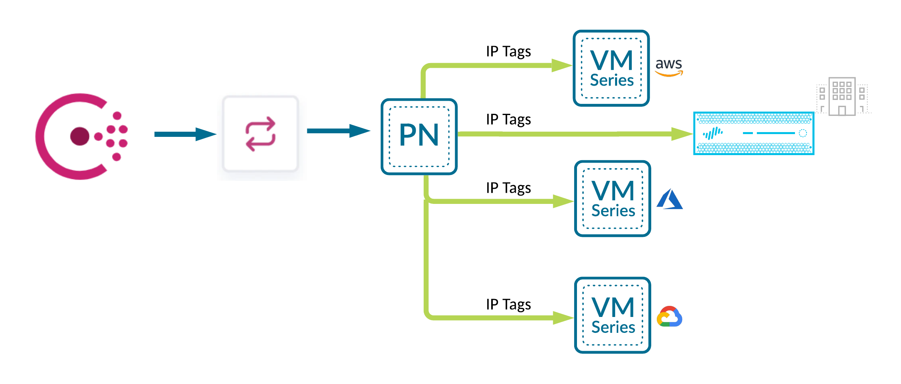

# Consul-Terraform-Sync + Palo Alto Networks NGFW Demo



## Prerequisites 

- Docker
- Docker Compose
- Palo Alto Networks Panorama or a NGFW

## Setup
1. Clone this repository
2. Set your environment variables

    ```
    export PANOS_HOSTNAME=
    export PANOS_USERNAME=
    export PANOS_API_KEY=
    ```
3. `docker-compose up -d`

## Testing procedure
1. Navigate to http://localhost:8500/ui on your local browser
2. Explore DNS service and health check
3. Open an SSH session to the firewall
4. View the registered-ip entries on the firewall
    ```
    show object registered-ip all
    ```
5. Scale out DNS servers
    ```
    docker-compose up --scale consul-client=2 -d
    ```
6. View the registered-ip entries on the firewall
    ```
    show object registered-ip all
    ```

## Commands

To view registered IP addresses  
```
show object registered-ip all
```

To clear all the registered IP addresses   
```
debug object registered-ip clear all
```

# Useful Links

- [Solution Brief](https://www.datocms-assets.com/2885/1621464663-consulpaloaltosolutionbriefdigital-3.pdf)  
- [NIA Module](https://registry.terraform.io/modules/PaloAltoNetworks/dag-nia/panos/latest)